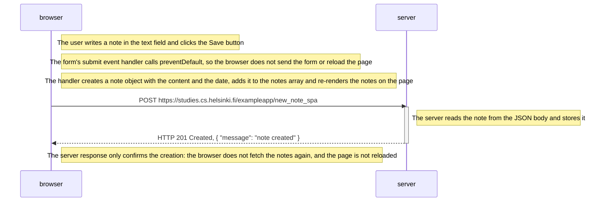

```mermaid
sequenceDiagram
    participant browser
    participant server

    Note right of browser: The user writes a note in the text field and clicks the Save button

    Note right of browser: The form's submit event handler calls preventDefault, so the browser does not send the form or reload the page

    Note right of browser: The handler creates a note object with the content and the date, adds it to the notes array and re-renders the notes on the page

    browser->>server: POST https://studies.cs.helsinki.fi/exampleapp/new_note_spa
    activate server
    Note right of server: The server reads the note from the JSON body and stores it
    server-->>browser: HTTP 201 Created, { "message": "note created" }
    deactivate server

    Note right of browser: The server response only confirms the creation: the browser does not fetch the notes again, and the page is not reloaded
```
